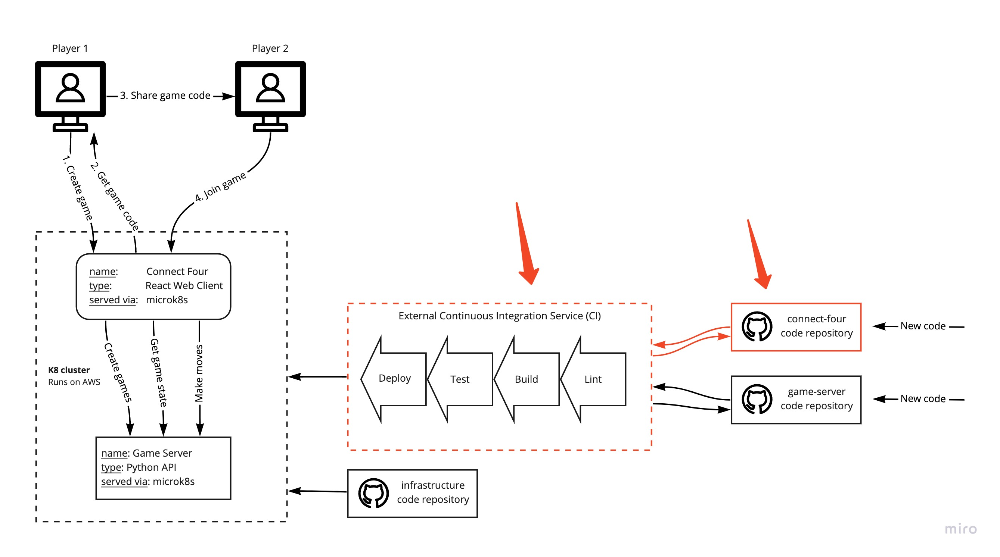
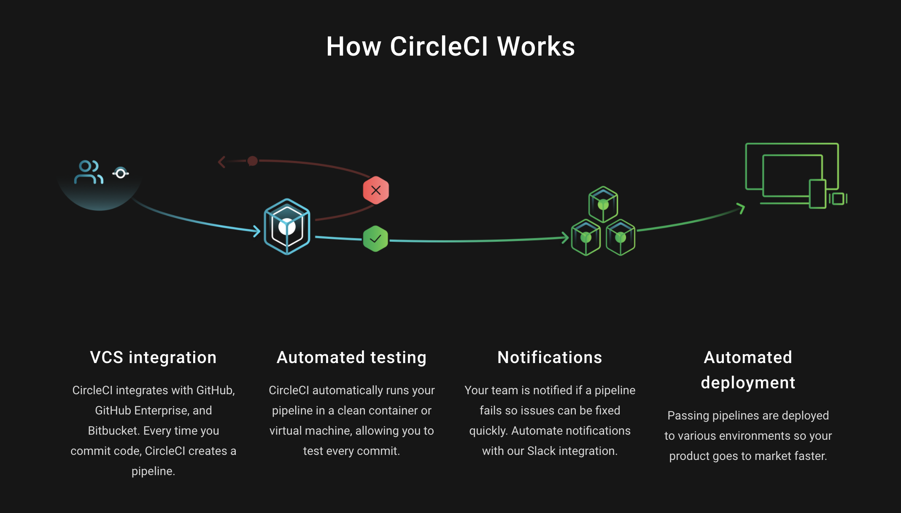

# Circle CI

Thursday 26.11.2020

# Continuous Integration

## Prerequisites
Before starting this part of the assignment we need to make sure we have the following up and running:
- [ ] An initial React web application
- [ ] A Dockerfile that successfully builds your application
- [ ] A DockerHub account
- [ ] A AWS instance running MicroK8s
- [ ] Kube config for you cluster (that's NOT stored in your Github repository)
- [ ] Your docker image runs successfully in your cluster.
If any of those are not finished please refer back to the previous days for help.

## Issues
Remember to use Github issues if you run into any problems and if you can we encourage you to answer issues from other students.
Information regarding how to submit issues can be found on Day 1.

## Objectives



Now that we have a running application and we have a way to deploy it so it's live for the world to see we of course want to automate the process. When automatic the deployment process we also want to make sure we don't deploy anything that is bugged or broken in any way. This is where CI (Continuous Integration) pipelines come in.
Basically, we want to be able to push our code and have a service that fetches our code, makes sure it's up to standards and deploys our application for us.
We will be starting with deployment and worry about quality insaurance later. After this day we should:
- [ ] Have Circle CI setup for our connect-four-client repository
- [ ] Have a pipeline that runs when we push code to our repository, the pipeline should:
    - [ ] Build a docker image from our code
    - [ ] Pushes the docker image to DockerHub
    - [ ] Deploys the new image to kubernetes

## Circle CI
When setting up a CI pipeline, there are multiple services available to us, some are hosted solutions and others can be hosted by us. I.e. we could deploy our own service, e.g. Jenkins, Tekton or others, that would run on an AWS instance in our AWS account and we would manage the all the infrastructure, i.e. creating the instance, network policies, installing the dependencies that are needed for the CI pipeline, etc. Hosting a CI service can be a great option when you want more control over the size of the instances running your pipeline and/or you don't want to pay for a hosted service.
In this course we are going to take a little shortcut and use a hosted service. There are mutliple ones available but we've decided to use Circle CI. It's very popular and they offer a way to get started for free so it's very good for small projects like ours. (Note: many companies use Circle CI for large projects and it works great, it will cost quite a bit though when you have a large infrastructure).


1. Start by creating an account on [Circle CI](https://circleci.com/), sign up with Github.

2. You should see a list of your Github projects. Find your `connect-four-client` project and go to "Set up Project".

3. Circle CI has a very simple setup process. It will offer your to create a sample config file (`config.yaml` is the config that Circle CI uses to run your pipeline). You can just choose "Add config" and Circle CI will create a branch in your repository with the new config file.

4. Observe the pipeline running and go to your repository to see that a new branch has been created. You can either create a pull request and merge the file or you can checkout the branch locally and continue your work from that branch.

### Our Pipeline
5. We now want to setup our pipeline jobs and steps. Circle CI organises the pipeline phases like so:

We want to begin by having three jobs that we'll need to run in order. (sometimes pipelines have jobs that can run in parallel, e.g. lint and tests can run at the same time because they don't depend on each other).
    1. Build docker image
    2. Push docker image
    3. Deploy image to kubernetes cluster
Let's start by modifying our Circle CI file like so:
```
version: 2.1

jobs:
  build:
    docker:
      - image: circleci/buildpack-deps:stretch
    steps:
      - checkout
      - run: echo "We want to build a docker image"
  publish:
    docker:
      - image: circleci/buildpack-deps:stretch
    steps:
      - run: echo "We want to push the docker image we built in the former step"
  deploy:
    docker:
      - image: circleci/buildpack-deps:stretch
    steps:
      - checkout
      - run: echo "We want to deploy our latest changes"

workflows:
  build_publish_deploy:
    jobs:
      - build
      - publish:
          requires:
            - build
      - deploy:
          requires:
            - publish
```
This file has one workflow, the workflow has three steps that run in order, build -> publish -> deploy and each job has two steps, first checkout your code from Github, next echo a placeholder for what we actually want to do.
Commit and push these changes to Github and make sure that your pipeline works and runs all jobs.
NOTE: We have not specified any branching logic, i.e. this pipeline will run on every change on any branch pushed to Github. This is fine for now but we might not always want to actually deploy on every push.

For each job in Circle CI we need to specify which build environment to use. We do that by specifying the build agent docker image, under:
```
    docker:
      - image: circleci/buildpack-deps:stretch
```
We can specify any image we want, depending on what dependencies we need for our environment. We're now using a simple base image but if we want to acutally compile some code like Python we would need an image that has Python installed.

### Build docker
6. Now we need to fill in the steps. Let's start with building a docker image. We already have a base docker image and we have a step that fetches our code, i.e. `checkout` is a helper function from Circle CI to make it easy to checkout code. We now need to setup docker so we can use it in our jobs, we can also use a Circle CI helper function for that called `setup_remote_docker`. Add it as a step after `checkout`. Next, let's build our docker image, it's nice to name your steps it can be done like this:
```
      - run:
          name: Build Docker image
          command: [INSERT YOUR DOCKER BUILD COMMAND]
```
Commit the code and push it to make sure your pipeline works.

### Publish docker
7. Next we need to publish the docker image to DockerHub so it can be used by our kubernetes cluster.
Firstly: In Circle CI each job is independed, i.e. it has it's own build agent that is pulled for each run and it needs to checkout your code. That means that when the 'build' job is finished and the 'publish' job starts the docker image that you built is gone. To be able to use artefact from previous jobs we need to persist them. You can do this by adding these steps after you've built your docker image:
```
      - run:
          name: Archive Docker image
          command: docker save -o image.tar $IMAGE_NAME
      - persist_to_workspace:
          root: .
          paths:
            - ./image.tar
```
NOTE: we're using an environment variable in the config file. These can be secrets that you don't want to store in your Github repo or just local variables that you want to set in one place so you don't need to replace them in multiple location if they change. Circle CI also has some environment variables accessible for us, one of these is the git commit hash (called CIRCLE_SHA1) which we want to use to tag our docker images.
This could be a good time to refactor some config into an executor.
> Executors define the environment in which the steps of a job will be run, allowing you to reuse a single executor definition across multiple jobs.
In the top part of your config file, add the following executor and use it in each job that uses docker:
```
version: 2.1

executors:
  docker-environment:
    environment:
      IMAGE_NAME: username/repository
    docker:
      - image: circleci/buildpack-deps:stretch

jobs:
  build:
    executor: docker-environment
    steps: ...
  ...
  publish:
    executor: docker-environment
    steps: ...
  ...
```
After setting up the environment we need to get the docker image from the build job, we can do it like so:
```
  publish:
    executor: docker-environment
    steps:
      - setup_remote_docker
      - attach_workspace:
          at: /tmp/workspace
      - run:
          name: Load archived Docker image
          command: docker load -i /tmp/workspace/image.tar
```
Next we need to add the step to push to Dockerhub, but for that to work we need to have a login. Dockerhub offers you to create a password token that you can use, we recommend doing that instead of using your password, but make sure that your credentials are not stored direclty in this file, you'll need to add it to docker's environment variables. You can find it under "Project Settings" -> "Environment Variables". Add this to your config:
```
      - run:
          name: Publish Docker Image to Docker Hub
          command: |
            echo "$DOCKERHUB_PASS" | docker login -u "$DOCKERHUB_USERNAME" --password-stdin
            docker push $IMAGE_NAME:$CIRCLE_SHA1
```
Make sure to commit and push your code to make sure it's working. Also check Dockerhub to see if a new image has been pushed recently.

### Deploy to kubernetes
8. Now we need to make sure that our kubernetes cluster runs our new image. On day 3 we learned how to use the kubernetes cli tool to apply our changes to the cluster. We need to have Circle CI do the same thing. To help us out we can add a Orb:
> CircleCI orbs are open-source, shareable packages of parameterizable reusable configuration elements, including jobs, commands, and executors. 
We'll be using an orb for kubernetes that includes helper functions for installing the kubectl cli and managing our config.
```
version: 2.1

orbs:
  kubernetes: circleci/kubernetes@0.11.2

executors:
...
```
We can now fill in the deploy step:
```
  deploy:
    docker:
      - image: circleci/buildpack-deps:stretch
    steps:
      - checkout
      - kubernetes/install-kubectl
      - kubernetes/install-kubeconfig:
          kubeconfig: KUBECONFIG_DATA
      - run: cat "k8s.yaml.template" | sed "s/{{IMAGE_TAG}}/${CIRCLE_SHA1}/g" > k8s.yaml
      - run: [INSERT KUBERNETES COMMAND]
```
To be able to deploy the docker image you just built we need to make sure we apply the correct image. To target the correct image we use the TAG. We need to replace the TAG part of your docker image name in our `k8s.yaml.template` file with the correct tag. Make sure you update your `k8s.yaml.template` to include the `IMAGE_TAG` string so it can be replaced:
`k8s.yaml.template`
~~~
...
    spec:
      containers:
      - image: docker.io/username/repository:{{IMAGE_TAG}}
...
~~~

If you push this code the CI would fail. That'a because Circle CI does not have any way of accessing your kubernetes cluster.

We need to add our `KUBECONFIG_DATA` to the Circle CI environment variables.
The Kube config is the file we use locally to access our kubernetes cluster. It should be secret and the way we add it to Circle CI is to base64 encode it and add it to environment variables. You can use this command:
```
cat ~/.kube/config | base64
```
Now you should be able to run your pipeline 🎉

### Only deploy on main merge
9. Now change your workflow so Circle CI only deploys when you merge to main.

## Handin

This is how your repositories should look after todays assignment which you
will submit on Friday.

connect-four-client repository:
```bash
.
├── .circleci
│   └── config.yml
├── public
│   ├── ...
│   └── index.html
├── src
│   ├── ...
│   ├── index.tsx
│   └── App.tsx
├── .dockerignore
├── .gitignore
├── Dockerfile
├── k8s.yaml.template
├── tsconfig.json
├── package-lock.json
└── package.json
```
